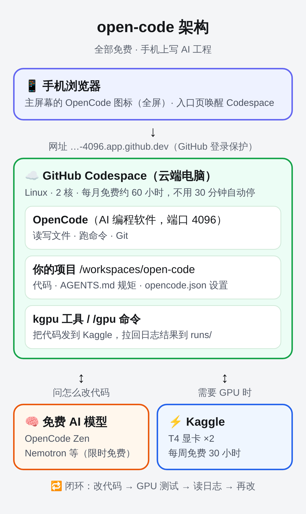

# open-code：手机 + Codespaces + OpenCode + Kaggle GPU

在手机上写 AI 工程：代码和 [OpenCode](https://github.com/anomalyco/opencode) 跑在 GitHub Codespaces 里；需要 GPU 时，一条命令把代码发到 Kaggle 的免费 T4 ×2 上运行，再把日志和结果拉回来。OpenCode 读日志、改代码、再测试，形成闭环。



```
📱 手机浏览器
      │
      ▼
GitHub Codespaces ─────────────────────────────────┐
  工程代码 · OpenCode（Web 界面：4096 端口）· Git · 终端  │
      │                                             │
      │ tools/kgpu run（需要 GPU 时）                 │ 读日志 → 改代码 → 再测试
      ▼                                             │
Kaggle（T4 ×2）                                      │
  在私有 Notebook 里运行工程代码：推理 / 测试          │
      │                                             │
      ▼                                             │
runs/<编号>/：日志、结果、输出文件 ───────────────────┘
```

## 一次性准备（全程可以在手机浏览器里完成）

### 1. Kaggle

1. 账号需要完成**手机号验证**，否则不能用 GPU，也不能联网（Settings → Phone verification）。
2. 打开 <https://www.kaggle.com/settings/api>，在 **API** 一栏点击 **Generate New Token**，复制生成的 token（以 `KGAT_` 开头）。

### 2. DeepSeek

OpenCode 默认用 DeepSeek 官方 API。打开 <https://platform.deepseek.com/api_keys> 创建一个 API key（以 `sk-` 开头），复制下来。账户里要有余额。

### 3. 创建 Codespace，同时填入 token

打开 <https://codespaces.new/langhua98/open-code>。页面上有 **KAGGLE_API_TOKEN** 和 **DEEPSEEK_API_KEY** 两栏，分别粘贴进去，然后点击 **Create codespace**。GitHub 会把它们保存成你的 Codespaces secret，以后新建的 Codespace 都会自动带上。

另一种方式是先在 <https://github.com/settings/codespaces> 里点 **New secret** 手动添加：Name 填 `KAGGLE_API_TOKEN`（或 `DEEPSEEK_API_KEY`），Repository access 选 `langhua98/open-code`。可选的 `OPENCODE_SERVER_PASSWORD` 也可以用同样方式添加，作为 Web 界面的密码。已经在用的 Codespace 添加 secret 后，要点提示里的重新加载（或 Rebuild Container）才能读到。

Token 只存在 Codespaces secrets 里，**不要写进仓库里的任何文件**。

第一次创建大约需要 3–5 分钟，会自动完成：

- 安装 OpenCode、它用的工具（浏览器、GitHub 命令 `gh`、Docker、文档处理库）和 Kaggle CLI；
- 用你的 token 登录 Kaggle，并打印本周 GPU 配额；
- 编辑器连上以后，在一个终端里启动 OpenCode 的 Web 界面（4096 端口）。以后每次打开这个 Codespace，都会自动这样启动。

## 日常使用

### 打开 OpenCode

- **手机推荐用 Web 界面**：在 Codespace 底部的 **端口（Ports）** 面板找到 `4096 (OpenCode Web)`，点地球图标在浏览器中打开。地址形如 `https://<codespace名>-4096.app.github.dev`。端口默认是私有的，只有登录了 GitHub 的你自己能访问。如果设置了 `OPENCODE_SERVER_PASSWORD`，用户名填 `opencode`。
  - **每个浏览器第一次打开时**：点「添加项目」（或输入框下方的「新建项目」），在搜索框输入 `/workspaces/open-code`，选中第一项。之后这个浏览器会记住这个项目。
  - **iPhone 上全屏用（推荐）**：在 Safari 里打开上面的地址，点「…」→「共享」→「添加到主屏幕」，开关保持打开，点「添加」。以后点主屏幕上的 OpenCode 图标，打开就是全屏的，没有浏览器的按钮。
    - 要添加的是 OpenCode 自己的页面。从入口页点进去的 OpenCode 会被套在一个上下都有按钮的小浏览器里，因为它和入口页不是同一个网站。
    - 主屏幕上的 OpenCode 和 Safari 的存储是分开的，第一次进去要再添加一次项目。
    - 私有端口的 GitHub 登录 3 小时过期，过期后打开时会闪一下 GitHub 登录页，然后自动回来。
  - **页面空白或打不开**：说明 OpenCode 没在运行。在 Codespace 的终端里输入 `web` 回车就能启动；输入 `web restart` 可以重启。运行 OpenCode 的那个终端不要关，关掉它 OpenCode 就停了。全屏的 OpenCode 没有刷新按钮：从后台划掉它，再点图标打开。
- **或者在终端里运行** `opencode`，进入终端界面（TUI）。
- **模型**：默认用 DeepSeek 官方 API 的 **DeepSeek V4 Pro**；起标题、写摘要这类小任务用更便宜的 **DeepSeek V4.1 Flash**（`opencode.json` 里的 `model` 和 `small_model`）。key 从 Codespaces secret `DEEPSEEK_API_KEY` 读取。
  - 想省钱，可以点输入框下方的模型名，换成 DeepSeek V4.1 Flash。
  - 如果提示没有 key 或认证失败，检查 secret 是否已添加、Codespace 是否已重新加载；也可以在 OpenCode 里输入 `/connect`，选 DeepSeek，临时粘贴 key。
  - 余额用完时，可以换一个 OpenCode Zen 的免费模型（标着「免费」的），不需要 key。
  - GitHub Copilot 已经在 `opencode.json` 的 `disabled_providers` 里隐藏了，因为 Copilot 免费版不包含 Claude Sonnet 这类模型，选了只会报错。以后如果订阅了 Copilot Pro，把 `"github-copilot"` 从这个列表里删掉就能用。

### OpenCode 能用的工具

除了读写文件、运行命令，OpenCode 在这个 Codespace 里还能用下面这些工具。直接用中文告诉它要做什么就行，它会自己挑工具：

| 工具 | 能做什么 | 可以这样说 |
| --- | --- | --- |
| 浏览器（Playwright） | 打开网页、点按钮、填表、截图 | 「用浏览器打开 example.com，告诉我页面上写了什么」 |
| 网页搜索 | 查最新的资料和报错的解决办法 | 「搜一下这个报错怎么解决」 |
| GitHub 命令 `gh` | 查看和创建 Issue、PR，查看 Actions 运行结果 | 「用 gh 看一下这个仓库最近的 Issue」 |
| Docker | 运行容器 | 重建容器以后才有，见下面 |
| 文档处理库 | 读写 PDF、Word、Excel、PPT，画图表 | 「把这个 Excel 画成折线图」 |
| 技能 | 代码审查、安全检查、上网调研、处理文档 | 「审查一下我的改动」「做个安全检查」 |

- 浏览器工具默认不加载，这样每次请求能少发约 2 万字节的工具说明，更省 token。要用浏览器时照常说「用浏览器……」，OpenCode 会把这一步交给 `browser` 子代理。在终端界面（TUI）里按 Tab 也可以直接切换到 browser 代理。
- 浏览器截图保存在 `.playwright-mcp/`，生成的文档放在 `outputs/`，这两个目录都不会提交到 git。
- 推送代码、开 PR 之前，OpenCode 会先问你。
- 免费模型用这些工具的本事一般（DeepSeek 好一些）：简单的事情可以，步骤很多的网页操作容易出错。

**已经在用的 Codespace 怎么更新**：在 Codespace 的终端里依次运行下面三条命令，大约需要 3 分钟：

```bash
git pull
bash .devcontainer/setup.sh
web restart
```

除了 Docker，其它工具马上就能用。Docker 要重建容器才有：点左上角的菜单 →「View（查看）」→「Command Palette（命令面板）」，输入 `Rebuild Container`，选择「Codespaces: Rebuild Container」。重建会清掉 `/workspaces` 以外的文件。OpenCode 的聊天记录已经由 `web` 命令搬到了 `/workspaces/.opencode-data`，重建后还在。

### 在 GPU 上测试：`/gpu`

在 OpenCode 里输入：

```
/gpu                                     # 运行 kgpu.toml 里的默认命令（示例：src/infer.py 模型推理）
/gpu -- python src/gpu_check.py          # 指定这一次要运行的命令
/gpu 测一下 1.5B 模型的推理速度            # 用自然语言描述，让它自己选命令
```

OpenCode 会先在本地做语法检查，然后把代码发到 Kaggle T4 ×2 运行，读取日志和结果。如果失败，它会修改代码再测，单次 `/gpu` 最多跑 3 轮 GPU。

### 也可以直接在终端里用 `kgpu`

```bash
kgpu run                          # 打包当前代码 → Kaggle 运行 → 实时显示日志 → 拉回结果
kgpu run -- python train.py --epochs 1
kgpu run --accelerator none       # 只用 CPU 跑，不消耗 GPU 配额
kgpu push                         # 只提交，不等结果（之后用 kgpu wait 取结果）
kgpu wait                         # 继续等待最近一次运行并拉回结果
kgpu status                       # 最近一次运行的状态
kgpu logs -f                      # 实时查看 Kaggle 控制台日志
kgpu quota                        # 本周 GPU 配额
```

每次运行的结果保存在 `runs/<编号>/`，`runs/latest` 永远指向最新一次：

| 文件 | 内容 |
| --- | --- |
| `kgpu.log` | 运行时打印的所有内容 |
| `kgpu_result.json` | 退出码、耗时、GPU 型号、每一步的退出码 |
| `outputs/` | 代码写到 `outputs/` 目录（或 `$KGPU_OUTPUT_DIR`）的文件 |
| `console.txt` | Kaggle 的原始控制台日志 |

### 代码是怎么到 Kaggle 上的

`kgpu` 把 git 能看到的文件（包括**还没提交的改动**，遵守 `.gitignore`）打包，嵌进一个私有 Kaggle Notebook（`<你的用户名>/open-code-gpu`）里运行，每次运行生成一个新版本。不需要先 commit 或 push；仓库是私有的也没关系。

- 单个文件超过 5 MB 会被跳过。数据集和模型权重请上传成 Kaggle Dataset 或 Model，在 `kgpu.toml` 的 `[sources]` 里声明，运行时会挂载到 `/kaggle/input/`。
- 需要额外安装的包写进 `requirements-gpu.txt`。Kaggle 镜像已经自带 torch、transformers 等常用库。
- 单次运行默认最长 1 小时（`kgpu.toml` 里的 `timeout`）。

## 文件说明

| 路径 | 作用 |
| --- | --- |
| `.devcontainer/` | Codespaces 配置：Python 3.12 + Node + Docker，自动安装 OpenCode、浏览器、`gh`、文档处理库和 Kaggle CLI，每次连上后启动 Web 界面 |
| `docs/` | 手机入口页（GitHub Pages）：<https://langhua98.github.io/open-code/>，一点唤醒 Codespace、打开 OpenCode |
| `tools/web` | 启动 OpenCode 网页版（终端里输入 `web`，重启用 `web restart`），并显示手机上要打开的网址；把聊天记录放在 `/workspaces/.opencode-data`，重建容器也不丢 |
| `tools/kgpu` | Kaggle GPU 运行器 |
| `kgpu.toml` | Kaggle 运行配置：默认命令、GPU 型号、联网、超时、数据集和模型挂载 |
| `requirements-gpu.txt` | Kaggle 上额外安装的 pip 包 |
| `src/infer.py` | 示例 AI 工程（默认任务）：每张 T4 各加载一份 Qwen2.5-0.5B-Instruct，分摊推理并检查答案，结果写到 `outputs/infer.json` |
| `src/gpu_check.py` | 硬件自检：检查两张 T4 是否都可用，并测 fp16 矩阵乘法速度 |
| `AGENTS.md` | 给 OpenCode 的项目规则：开发闭环、节省 GPU 配额、不泄露密钥 |
| `.opencode/commands/gpu.md` | OpenCode 的 `/gpu` 命令 |
| `.opencode/skills/` | OpenCode 的技能：代码审查、安全检查、上网调研、处理文档 |
| `opencode.json` | OpenCode 项目配置：默认 DeepSeek 模型、隐藏 Copilot、接上浏览器工具（默认不加载，交给 `browser` 代理用）、装上 [Superpowers](https://github.com/obra/superpowers) 技能插件（v6.4.2） |
| `tests/` | `kgpu` 的单元测试：`python3 -m unittest discover -s tests` |

## 额度与注意事项

- **Kaggle GPU**：每周 30 小时，每周刷新，用 `kgpu quota` 查看剩余。把能在 CPU 上验证的都放在本地跑，GPU 只用来跑真正需要它的部分。
- **Codespaces**：GitHub 免费账号每月有 120 核·小时（2 核机器约 60 小时）和 15 GB 存储。没有任何操作 30 分钟后会自动停止；OpenCode 干活时会在终端里输出日志，这也算操作，所以用着的时候不会停。不用时到 <https://github.com/codespaces> 停止或删除。
- Kaggle 上的任务不依赖 Codespace：提交之后关掉 Codespace 也没关系，回来后运行 `kgpu wait` 就能取回结果。
- 如果 token 泄露（比如发到了聊天里），到 Kaggle 设置页重新生成，并更新 Codespaces secret。
